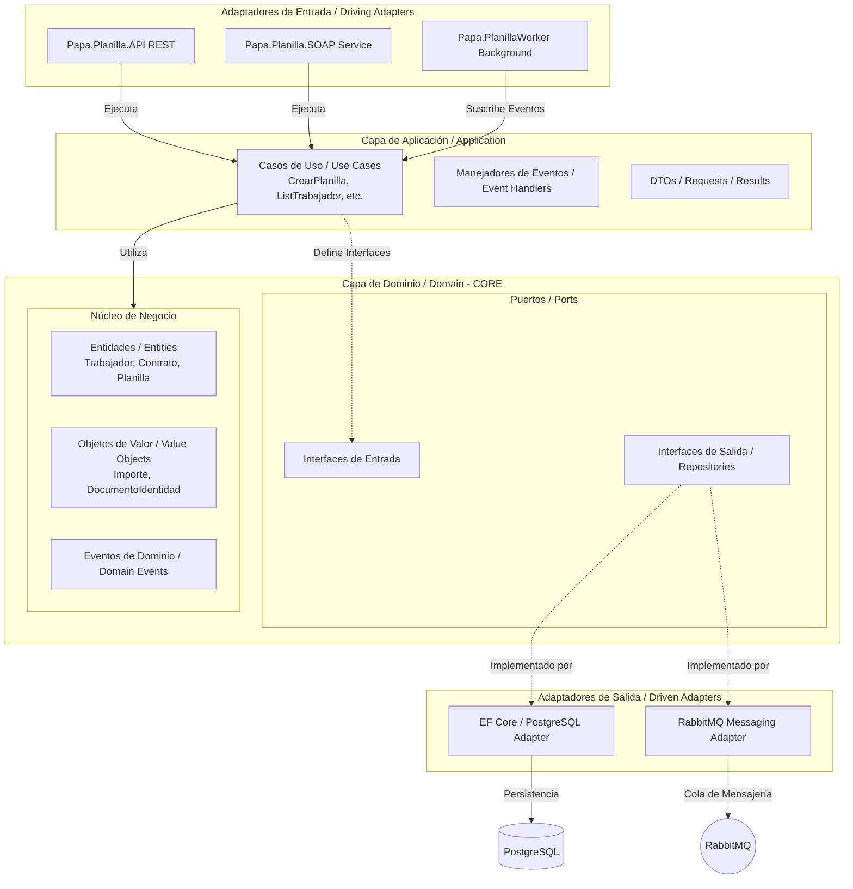

# Sistema de Planillas

El **Sistema de Planillas** es una solución empresarial de software diseñada para la gestión integral de trabajadores, contratos, planillas, unidades orgánicas y cargos. Está desarrollado en la plataforma **.NET 10.0** bajo los principios del desarrollo orientado al dominio (**DDD**) y estructurado utilizando una **Arquitectura Hexagonal (Puertos y Adaptadores)** para asegurar que el núcleo de la aplicación permanezca totalmente desacoplado y testeable.

---

## 🏗️ Arquitectura del Sistema

La solución implementa **Arquitectura Hexagonal**, organizando el sistema en capas concéntricas aisladas. El núcleo (*Core*) contiene las reglas de negocio y no tiene dependencias de tecnologías externas (como bases de datos o frameworks), comunicándose con el exterior únicamente a través de **Puertos** (interfaces). Los **Adaptadores** externos (API, SOAP, Postgres, RabbitMQ) se acoplan a la aplicación implementando o consumiendo estos puertos.

### Diagrama de Arquitectura (Mermaid)

El siguiente diagrama detalla el flujo de control, la división de capas y los puertos y adaptadores definidos en el sistema:



---

## 📂 Capas del Proyecto

La solución está dividida en los siguientes proyectos:

### 1. [Papa.Planilla.Domain](file:///d:/Ejercicios/NET/Papa.Planilla/Papa.Planilla.Domain) (El Núcleo)
Contiene las reglas de negocio más puras e independientes de infraestructura:
* **Entities**: Modelos enriquecidos con comportamiento que protegen sus invariantes mediante constructores privados y métodos de creación factoría (`Crear()`), como [Trabajador](file:///d:/Ejercicios/NET/Papa.Planilla/Papa.Planilla.Domain/Entities/Trabajador.cs) o [Planilla](file:///d:/Ejercicios/NET/Papa.Planilla/Papa.Planilla.Domain/Entities/Planilla.cs).
* **Value Objects**: Clases sin identidad propia que encapsulan reglas de validación específicas (ej. [DocumentoIdentidad](file:///d:/Ejercicios/NET/Papa.Planilla/Papa.Planilla.Domain/ValueObjects/DocumentoIdentidad.cs) o [Importe](file:///d:/Ejercicios/NET/Papa.Planilla/Papa.Planilla.Domain/ValueObjects/Importe.cs)).
* **Events**: Eventos internos de dominio que se disparan en respuesta a transacciones exitosas (ej. `PlanillaCreatedDomainEvent`).
* **Ports**: Interfaces de repositorio (ej. `ITrabajadorRepository`) e interfaces de servicios de terceros que especifican qué necesita el dominio del mundo exterior.

### 2. [Papa.Planilla.Application](file:///d:/Ejercicios/NET/Papa.Planilla/Papa.Planilla.Application) (Casos de Uso)
Orquesta el flujo de datos desde y hacia el dominio:
* **Use Cases**: Contiene la lógica detallada para ejecutar cada acción de negocio (ej. [CreatePlanillaUseCase](file:///d:/Ejercicios/NET/Papa.Planilla/Papa.Planilla.Application/Features/Planilla/UseCases/CreatePlanillaUseCase.cs)).
* **DTO**: Modelos planos de transferencia de datos de entrada/salida (ej. `CreatePlanillaRequest`).
* **Event Handlers**: Suscriptores a los eventos de dominio que ejecutan procesos complementarios (ej. despachar eventos de integración hacia la mensajería).

### 3. [Papa.Planilla.Infraestructure](file:///d:/Ejercicios/NET/Papa.Planilla/Papa.Planilla.Infraestructure) (Adaptadores de Salida)
Contiene las herramientas tecnológicas y librerías externas que soportan el sistema:
* **Persistencia**: Adaptador de base de datos relacional usando EF Core y Npgsql. Incluye las configuraciones del modelo de base de datos (`IEntityTypeConfiguration`) e implementaciones de los repositorios.
* **Mensajería**: Implementa la producción y consumo de mensajes para RabbitMQ (`RabbitProducerService` y `RabbitConsumerService`).

### 4. Capas de Entrada (Adaptadores de Entrada)
* **[Papa.Planilla.API](file:///d:/Ejercicios/NET/Papa.Planilla/Papa.Planilla.API)**: API REST con controladores que exponen los endpoints públicos del sistema.
* **[Papa.Planilla.SOAP](file:///d:/Ejercicios/NET/Papa.Planilla/Papa.Planilla.SOAP)**: Exposición de endpoints XML mediante SOAP (utilizando SoapCore) para integraciones legadas.
* **[Papa.PlanillaWorker](file:///d:/Ejercicios/NET/Papa.Planilla/Papa.PlanillaWorker)**: Servicio de Background de .NET que consume eventos asíncronos distribuidos en colas de RabbitMQ.

---

## 🛠️ Patrones de Diseño Aplicados

* **Repository Pattern**: Separa la definición conceptual de las operaciones de datos en la capa de *Domain* (`ITrabajadorRepository`) de su implementación concreta en *Infrastructure* (`TrabajadorRepository`).
* **Unit of Work (Unidad de Trabajo)**: Asegura la consistencia transaccional del negocio agrupando múltiples operaciones de repositorios y enviándolas en un solo guardado (`SaveChangesAsync`).
* **Factory Pattern**: Centraliza la instanciación válida de las entidades mediante métodos de factoría estáticos (como `Trabajador.Crear(...)`), lo que previene estados de dominio inválidos o inconsistentes.
* **Domain Driven Design (DDD)**:
  * Entidades ricas en comportamiento (comportamiento encapsulado, modificadores `private set`).
  * Objetos de valor inmutables.
  * Eventos de dominio para comunicación desacoplada dentro del mismo límite.

---

## ⚖️ Principios SOLID Aplicados

* **Single Responsibility Principle (SRP)**: Cada caso de uso (ej. `CreatePlanillaUseCase`) realiza una única tarea de negocio independiente, minimizando efectos colaterales.
* **Open/Closed Principle (OCP)**: La incorporación de nuevos servicios externos (ej. cambiar RabbitMQ por Azure Service Bus) se realiza creando nuevos adaptadores e implementando interfaces preexistentes sin alterar la capa de negocio.
* **Liskov Substitution Principle (LSP)**: Las implementaciones concretas de los adaptadores de persistencia y servicios de RabbitMQ pueden sustituir directamente a sus interfaces sin cambiar el comportamiento del llamador.
* **Interface Segregation Principle (ISP)**: Interfaces pequeñas y específicas de repositorios y servicios de mensajería (como `IRabbitProducerService` o `IPlanillaRepository`) en lugar de interfaces monolíticas.
* **Dependency Inversion Principle (DIP)**: La capa de Aplicación y Dominio no dependen de la capa de Infraestructura; en su lugar, la Infraestructura depende de las interfaces expuestas por el Dominio/Aplicación.

---

## 💾 Tecnologías e Integraciones

* **Base de Datos**: PostgreSQL 15.3 (Almacenamiento relacional de negocio).
* **Broker de Mensajería**: RabbitMQ 3 (Intercambio de eventos asíncronos).
* **Framework**: .NET 10.0 (C#).
* **Mapeador ORM**: Entity Framework Core.
* **Servicio SOAP**: SoapCore (Compatibilidad SOAP/WSDL).

---

## ⚙️ Configuración y Requisitos de Desarrollo

### Requisitos Previos
* **.NET SDK 10.0**
* **Docker Desktop** (para levantar base de datos y colas rápidamente)
* **EF Core CLI**: Ejecuta `dotnet tool install --global dotnet-ef` si no lo tienes instalado.

### Configuración del Entorno (`appsettings.Development.json`)
Asegúrate de configurar correctamente las cadenas de conexión y accesos de mensajería:

```json
{
  "ConnectionStrings": {
    "DbPlanilla": "Host=localhost;Port=1502;Database=db_planilla;Username=admin;Password=Password2026"
  },
  "RabbitSetting": {
    "Hostname": "localhost",
    "Username": "admin",
    "Password": "Password2026"
  }
}
```

---

## 🚀 Despliegue y Ejecución

### 1. Iniciar Infraestructura local (Docker Compose)
Levanta las instancias locales de PostgreSQL y RabbitMQ ejecutando el siguiente comando en la raíz del proyecto:
```bash
docker-compose up -d
```
Esto creará y expondrá:
* **PostgreSQL**: Puerto `1502`
* **RabbitMQ**: Puerto `5672` (Broker) y `15672` (Panel de Administración Web: `http://localhost:15672`)

### 2. Ejecutar Migraciones de Base de Datos
Aplica las migraciones pendientes para crear el esquema en base de datos PostgreSQL:
```bash
dotnet ef database update --project Papa.Planilla.Infraestructure --startup-project Papa.Planilla.API
```

### 3. Iniciar los Servicios
Puedes iniciar cada aplicación de manera individual mediante `dotnet run` o configurar el IDE para iniciar múltiples proyectos simultáneamente (API, SOAP y Worker):

```bash
# Para iniciar la API REST
dotnet run --project Papa.Planilla.API

# Para iniciar el Worker de segundo plano
dotnet run --project Papa.PlanillaWorker

# Para iniciar el servicio SOAP (Por defecto usa el perfil HTTP en puerto 5007)
dotnet run --project Papa.Planilla.SOAP

# Para iniciar el servicio SOAP especificando el perfil HTTPS (puerto 7289)
dotnet run --project Papa.Planilla.SOAP --launch-profile https
```
